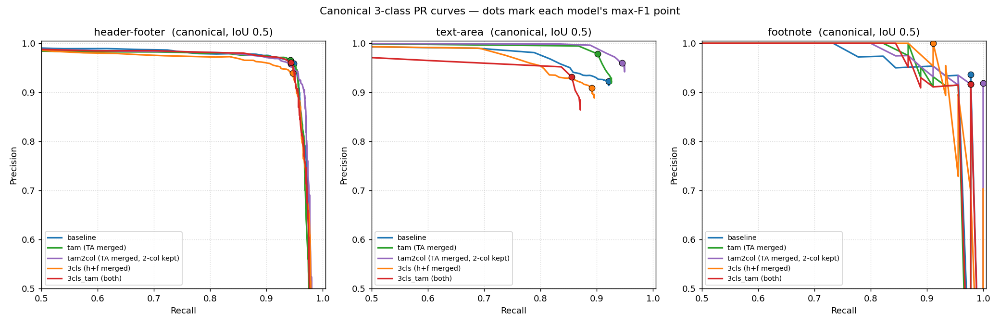

# We just wanted to delete the headers

*How a small "solved" preprocessing step for Tibetan OCR turned into a proper
model bake-off — and a few counter-intuitive lessons about how you measure
success.*

We are building a high-accuracy OCR system for scanned **modern Tibetan books**.
Our goal downstream is clean etext: the actual body of the work, with none of the
clutter that lives around it. On a Tibetan page that clutter is very real —
running headers (མགོ་བྱང་) march along the top or side margin, folio numbers and
marginal notes sit in the footer, and footnotes crowd the bottom of the block. If
you feed all of that to an OCR engine and concatenate the output, you get a text
stream where a chapter title interrupts a sentence and a page number lands in the
middle of a word. So before we OCR anything, we want to find and set aside the
headers and footers, and isolate the footnotes from the main text.

Simple enough. Our first instinct was *not* to train anything. Document layout
analysis is a mature field; there are open-source detectors, cloud APIs, and now
vision-language models that will happily draw boxes around anything you ask. This
felt like a solved problem that we could solve with an API key.

So we ran a benchmark. Colleagues on the BDRC Etext / OpenPecha team put nine
systems up against a Tibetan layout benchmark and
[wrote up the results](https://forum.openpecha.org/t/how-well-do-existing-layout-detection-models-handle-tibetan-books/610).
The short version: it is not a solved problem.

- The best off-the-shelf model, **Surya**, reached 81.9% mAP@0.5 — but only after
  a heavy post-processing pass that merged same-class boxes within a 1500-px
  radius. Its *raw* output scored **34%**, because it shattered each text region
  into a thousand-plus fragments per page.
- **Footnotes** were where most systems simply gave up: DocYOLO, PaddleOCR, and
  YOLO11 scored **0–1% AP** on them.
- The general-purpose **VLMs** were the most humbling. Gemini 2.5 Flash nailed the
  text body (90.7% AP) and then collapsed on the margins — **5.3% AP on headers,
  1.4% on footers** — hallucinating hundreds of phantom headers along the way.

### A fair complaint about our own benchmark

Reading that benchmark critically, there's a gap: it evaluated open-source layout
models and VLMs, but never tried the **commercial document-AI incumbents** — the
services whose entire pitch is structured layout with named roles. That omission
is worth naming:

- **Azure AI Document Intelligence** is the strongest "should have tried"
  candidate. Its layout model assigns paragraph *roles* that include
  `pageHeader`, `pageFooter`, `pageNumber` and — unusually — an explicit
  **`footnote`** role. On paper it targets exactly our four regions.
- **AWS Textract** (Layout) returns `HEADER`, `FOOTER`, and `PAGE_NUMBER` blocks,
  but has **no footnote class**.
- **Google Document AI** and **ABBYY FineReader** both reconstruct document
  structure and separate running heads/footers, though footnote handling is
  weaker or geared toward reflowing Latin-script PDFs.

So could one of these have quietly solved our problem? We doubt it, for reasons
the benchmark already hints at. Every one of these products is trained
overwhelmingly on Western business documents — invoices, contracts, English
books. Tibetan uchen script, dense pointed text, and margin-hugging running
titles are wildly out of distribution, and the one general commercial-grade proxy
we *did* test (Gemini) fell apart on precisely the header/footer regions that make
Tibetan layout distinctive. On top of that, these are closed, per-page-priced
services: for a corpus that will run to millions of pages, and for a project whose
output is meant to be an **open, reproducible dataset and model**, we can neither
afford them nor retune them to Tibetan conventions.

Our prior was that no off-the-shelf system both (a) exposes
header/footer/footnote as targetable classes *and* (b) has seen anything like a
Tibetan book — so we trained our own. But a prior isn't a measurement, so later in
this post we stop speculating and actually run the two strongest candidates —
**Azure AI Document Intelligence** and **Surya** — on our own 860-page test set
(see [*So could we have just used an off-the-shelf system?*](#so-could-we-have-just-used-an-off-the-shelf-system)).
The verdict is mostly "yes, we were right," with one genuine surprise. This is the
story of how — and why the interesting part turned out to be not the training, but
the measuring.

## What we're actually detecting

Four regions per page:

- **text-area** — the main body text (sometimes several blocks, and on some pages
  laid out in **two columns**);
- **header** — running title / marginal text at the top or side;
- **footer** — folio numbers and marginal text at the bottom or side;
- **footnote** — notes below the main text area.

Downstream we mostly care about three things: keep the text-area, drop
header+footer, and peel off footnotes. (Whether a marginal box is a "header" or a
"footer" barely matters to us — a distinction that will come back later.)

## The data: the part that actually took the time

Building a trustworthy dataset was more work than any of the training runs.
Annotations were produced on the [Ultralytics platform](https://platform.ultralytics.com/)
across several batches. The first thing we hit was a modeling constraint: the
platform only supports **axis-aligned bounding boxes**. On a slightly rotated
scan, an axis-aligned box is a little loose. We decided to live with it — the
looseness is small and consistent — rather than jump to oriented boxes.

The rest was discipline:

- **Leakage-free splitting.** We split at the **volume** level — every page of a
  given book stays in one split — and stratified so that the rare footnote-bearing
  volumes are represented in train, val, and test. Augmented images were confined
  to **train only**, so validation and test are clean, original scans.
- **A consistency audit.** A geometric/logical pass flagged likely annotation
  mistakes: near-duplicate boxes (IoU > 0.9), conflicting classes on the same
  region, physically impossible orderings (a footer above a header, a header below
  the middle of the text, a footnote that isn't below the text), out-of-bounds and
  degenerate boxes, and suspiciously tiny or corner-stuck headers/footers. About
  260 flagged pages went back for manual correction.
- **Release.** The cleaned dataset is published (gated, fair-use) on the Hugging
  Face Hub, with every coordinate clamped to `[0,1]`.

Final tally: **8,325 images** (6,751 train / 714 val / 860 test), ~25,500 boxes.

## Round 1 — which architecture?

We trained several detectors at 1024 px and scored them on the held-out test
split: YOLO26s/m, **DocLayout-YOLO** (a YOLOv10 fork pre-trained on document
structure), and **RT-DETR-l**.

| model | test mAP50 | test mAP50-95 |
|---|---|---|
| DocLayout-YOLO (best) | 0.936 | 0.745 |
| **RT-DETR-l (best)** | **0.954** | **0.754** |

RT-DETR-l won and became our reference model. (These numbers are on our own
860-image test split and are *not* directly comparable to the benchmark's smaller,
differently-annotated set — but they were enough to tell us domain-specific
training was worth it.)

### A useful detour: which checkpoint do you keep?

Here's a question that sounds pedantic and isn't: once training is done, *which*
epoch's weights do you ship? We compared the "elbow" checkpoint (just after the
loss stops dropping quickly) against the converged, validation-selected `best.pt`:

- DocLayout kept *improving on the test set* right up to its val-best — no
  marginal-tail overfitting at all; the elbow checkpoint simply underfit (footnote
  AP climbed 0.76 → 0.95 with more training).
- RT-DETR, pushed a few epochs *past* its val-best, **regressed on test** (footer
  mAP50-95 slid 0.63 → 0.52).

The literature (early stopping — Prechelt 1998; deep double descent — Nakkiran et
al. 2019; stochastic weight averaging — Izmailov et al. 2018) is clear that
neither the elbow nor the last epoch is reliably best; the robust choice is the
**validation-selected checkpoint with EMA weight averaging** — which is exactly
what the Ultralytics stack saves as `best.pt`. So we kept it and moved on.

## Round 2 — does relabelling help? (and a lesson in fair evaluation)

Now the interesting part. We suspected that *how you frame the labels* might
matter as much as the architecture, so we trained four RT-DETR variants on the
same split:

- **baseline** — 4 classes, text-area left as-is (possibly several boxes/page).
- **tam** — 4 classes, but all text-area boxes **merged** into one envelope/page.
- **3cls** — header and footer **merged** into a single `header-footer` class.
- **3cls_tam** — both of the above.

Taken at face value, the merged curricula looked spectacular — `tam`'s text-area
mAP50-95 leapt from 0.86 to 0.98! But that is a **measurement artifact**: a single
big merged box is trivial to localize, so the per-class mAP inflates for free. If
we'd stopped there we'd have fooled ourselves.

To compare honestly, we built a **canonical evaluator** that maps *every* model
into one common space and applies the merges as post-processing, so the metric is
identical for all of them:

- **header + footer combined** into one class, with boxes matched *individually*
  (a relabelling, **not** an envelope — a header at the top and a footer at the
  bottom must not merge into a page-sized box);
- **text-area merged** into one envelope per page, done as post-processing even
  for models that weren't trained that way;
- **footnote** left untouched.

In this apples-to-apples space (all five variants retrained on the final dataset,
860 test images):

| model | header-footer | text-area | footnote | mean AP50 | mean AP50-95 |
|---|---|---|---|---|---|
| baseline | 0.969 / 0.690 | 0.975 / 0.902 | 0.970 / 0.818 | 0.971 | 0.803 |
| tam | 0.960 / 0.687 | 0.985 / 0.929 | 0.970 / 0.807 | 0.972 | 0.808 |
| **tam2col** | 0.965 / 0.683 | **0.988** / 0.910 | **0.991** / 0.824 | **0.981** | 0.806 |
| 3cls | 0.959 / 0.676 | 0.967 / 0.869 | 0.984 / 0.808 | 0.970 | 0.784 |
| 3cls_tam | 0.964 / 0.705 | 0.981 / 0.929 | 0.968 / 0.796 | 0.971 | 0.810 |

*(each cell is AP50 / AP50-95; `tam2col` is introduced below)*

Once the playing field is level, the dramatic gaps evaporate: on AP50-95 the
curricula are all within noise of each other (0.78–0.81). But three real signals
survive:

- **Keep header and footer as *separate* training classes.** Models given the
  distinction score as high or higher on the *combined* class than the model
  trained on pre-merged labels. Richer supervision plus a loss-free post-hoc merge
  beats throwing the distinction away up front.
- **Training on merged text-area genuinely helps text-area** (0.902 → 0.929
  AP50-95) — but it needs a higher confidence threshold to pay off.
- The canonical metric, by construction, **can't see** one thing that turned out
  to matter a lot: two-column pages.

### Precision and recall — the three classes we actually care about

Since header-vs-footer confusion is irrelevant to us, we evaluate the three
meaningful classes — **text-area, header+footer, footnote** — and sweep the
confidence threshold. Best-F1 operating points (canonical space):

| class | baseline | tam | **tam2col** | 3cls | 3cls_tam |
|---|---|---|---|---|---|
| header-footer | 0.954 @.57 | 0.954 @.67 | 0.950 @.65 | 0.943 @.56 | 0.952 @.67 |
| text-area | 0.922 @.67 | 0.938 @.95 | **0.952 @.89** | 0.900 @.80 | 0.892 @.95 |
| footnote | 0.957 @.63 | 0.946 @.25 | **0.957 @.23** | 0.954 @.70 | 0.946 @.46 |

Recall is uniformly high (0.90–1.00); **precision is the differentiator**.

### The confidence threshold is not one number

The single most useful practical lesson: **the right confidence threshold differs
by class**, and the Ultralytics default of 0.25 is wrong for most of them.

At `conf=0.25`, header/footer **precision collapses to ~0.83** — the detector
cheerfully over-predicts small marginal boxes. Sweeping the threshold shows how
cheap the fix is:

| conf | P | R | F1 |
|---|---|---|---|
| 0.25 (default) | 0.83 | 0.97 | 0.894 |
| 0.45 | 0.93 | 0.96 | 0.941 |
| 0.55 | 0.95 | 0.95 | 0.947 |
| **0.60** | **0.95** | **0.95** | **0.950** |
| 0.65 | 0.96 | 0.94 | 0.950 |

Nudging header/footer from 0.25 to **~0.60** buys +0.12 precision for a −0.02
recall cost — F1 0.894 → 0.950.

Text-area is subtler, and nearly tricked us. In the *canonical* (merged-envelope)
space it looks threshold-insensitive, because the envelope inherits the highest
confidence among its boxes. But a **native per-class sweep** (scoring each
text-area box on its own) reveals a real, cheap precision gain: raising text-area
from 0.25 to **~0.55** lifts precision 0.955 → 0.98 for a 0.002 recall cost,
quietly dropping ~23 low-confidence spurious boxes. Footnote, meanwhile, is best
left *low* (~0.25, recall 1.00) — its few false positives are high-confidence and
can't be thresholded away without losing genuine footnotes.

The practical recipe: **per-class thresholds** — header/footer ≈ 0.60, text-area
≈ 0.55, footnote ≈ 0.25 — or a single global **0.50** if you need one knob.

## The two-column problem

Some pages set the body text in two columns, and squashing those into one box is
just wrong. We added a small **heuristic** that keeps two text-area boxes when a
page is genuinely two-column: the boxes must split into a left/right pair that are
**horizontally disjoint** (overlap < 20% of the narrower column's width) and
**vertically co-extensive** (share ≥ 30% of the shorter column's height). Across
the dataset this fires on ~175 pages (~2%). We trained a variant, **`tam2col`**,
that merges text-area *except* on those pages — and it turned out to be the
strongest model of the lot.

The catch is that its advantage is invisible to the canonical metric, which
re-merges the two columns back into one envelope. You only see it on the model's
own label schema:

| model | text-area mAP50 | text-area mAP50-95 |
|---|---|---|
| baseline (raw multi-box) | 0.923 | 0.864 |
| **tam2col** | **0.994** | **0.980** |

That is the real reason to prefer `tam2col`: it gets two-column pages right —
one clean box per column — without regressing anything else.

## So could we have just used an off-the-shelf system?

We opened with a hunch that the commercial and open incumbents wouldn't cut it.
Hunches are cheap, so we tested it properly: we ran several off-the-shelf systems on
our own 860-page test set and scored them with the **exact same canonical
evaluator** as our own models (header+footer combined, text-area merged into one
envelope, IoU ≥ 0.5). The contenders:

- **Azure AI Document Intelligence** (`prebuilt-layout`) — the commercial
  incumbent that, on paper, has the perfect schema: `pageHeader`, `pageFooter`,
  `pageNumber`, and an explicit `footnote` role. It returns no confidence scores,
  so it has a single, un-thresholdable operating point.
- **Surya** — the best performer in the OpenPecha benchmark. Modern Surya routes
  layout through a 650M vision-language model, but it also ships a lightweight,
  pure-PyTorch layout detector (`surya_layout2`, an **RF-DETR** — Roboflow's
  DINOv2-based detector, *not* to be confused with the Baidu **RT-DETR** we
  fine-tuned). We benchmark that detector at its best-F1 confidence.
- **DocLayout-YOLO** (DocStructBench) — the strong open-source document detector,
  swept to its best-F1 confidence.
- **PP-DocLayout-L** (PaddleOCR) — Baidu's document-layout RT-DETR variant,
  pretrained on Chinese document structure, swept to its best-F1 confidence.
- **Docling layout-heron** (IBM) — an RT-DETRv2 detector with explicit
  `page_header`, `page_footer`, and `footnote` classes, swept to its best-F1
  confidence.

Everyone gets the easy question right and diverges on the hard ones (best-F1
operating points, canonical 3-class F1):

| system | header-footer | text-area | footnote | **mean F1** |
|---|---|---|---|---|
| **Ours — `tam2col` (fine-tuned RT-DETR-l)** | 0.949 | 0.998 | **0.933** | **0.960** |
| Surya fast layout (RF-DETR, off-the-shelf) | 0.895 | 0.989 | 0.439 | 0.774 |
| PP-DocLayout-L (off-the-shelf) | 0.485 | 0.865 | 0.667 | 0.672 |
| Docling layout-heron (off-the-shelf) | 0.481 | 0.992 | 0.397 | 0.624 |
| Azure AI Document Intelligence | 0.625 | 0.989 | 0.404 | 0.673 |
| DocLayout-YOLO (DocStructBench) | 0.657 | 0.886 | 0.000 | 0.515 |

Three things jump out. **Text-area is a solved problem** — Azure, Surya, Docling
heron, and PP-DocLayout-L all tie or nearly tie our model at ~0.99–1.00 on
text-area, so if all you want is "where is the body text," an API key or an
off-the-shelf detector would do. The **surprise** is that Surya's off-the-shelf
RF-DETR is a genuinely good header/footer detector (0.895, essentially our
level) — much better than the OpenPecha benchmark's raw-Surya numbers suggested.
PP-DocLayout-L and Docling heron off-the-shelf are weaker on headers (≈0.48) but
already expose a footnote class — PP-DocLayout reaches 0.667, Docling 0.397. And
**footnotes remain the wall for anything not fine-tuned**: only trained models
clear 0.92; DocLayout-YOLO, which has no page-footnote class, scores a literal
zero.

### The failure that actually matters: contamination

An F1 number hides *how* a model fails, and for our pipeline the *how* is
everything. We crop the predicted text-area and send it to OCR, so there are two
very different ways to miss a header:

1. **Absorb it** — the text-area box grows to swallow the header, and its text
   gets OCR'd as body text. This silently corrupts the etext. **This is the
   failure we cannot tolerate.**
2. **Drop it cleanly** — no header box is emitted, but the text-area stays tight,
   so the body text is still clean. We lose the header, but we don't poison the
   text.

So we measured, for every ground-truth header/footer and footnote, whether a model
that *failed to detect it* had **folded that region into its text-area envelope**
(≥ 50% of the region inside the predicted body block):

| system | header/footer detected | …folded into text-area | footnote detected | …folded into text-area |
|---|---|---|---|---|
| **Ours — `tam2col`** | 96% | **0.6%** | 93% | **2%** |
| Surya fast layout | 91% | 1.2% | 56% | 16% |
| Azure Document Intelligence | 58% | **12%** | 44% | **22%** |
| DocLayout-YOLO | 67% | 6% | 0% | 20% |

*("folded into text-area" = share of **all** ground-truth regions of that type
that the system both missed **and** buried inside its OCR text block.)*

This is the number that answers the title question. **Azure would fold roughly one
in eight running heads / folio numbers, and more than one in five footnotes,
straight into the body text.** On a corpus headed for millions of pages, that is
systematic, silent contamination of exactly the etext we are trying to keep clean
— precisely the problem we set out to solve. Its headline text-area F1 of 0.989
looks reassuring right up until you notice *what* that text block contains.

Surya is the real revelation: as a header/footer detector it is nearly as clean as
our fine-tuned model (1.2% absorbed), so for header/footer removal alone it would
be a defensible off-the-shelf choice. But it still buries **16% of footnotes** in
the body text, and its strongest configuration is the heavyweight VLM stack; the
weights are also OpenRAIL-M-licensed (free for research and nonprofits, paid above
a revenue threshold), which complicates an open release.

Our `tam2col` model, by contrast, contaminates the body text on **0.6%** of
headers/footers and **2%** of footnotes — an order of magnitude cleaner than
Azure, and the deciding factor for a downstream OCR pipeline.

So: **could we have used Azure? No.** Not because it can't find the text — it can
— but because when it misses the clutter, it hides that clutter *inside* the text.
Surya could plausibly handle header/footer stripping, but not footnotes, and not
under a license we'd want for an open release. The one-sentence answer to the
question we started with is: the off-the-shelf systems are good enough to find your
text and not good enough to protect it.

### Fine-tuning the strongest off-the-shelf candidates

The Surya result raised a natural follow-up: Surya's fast layout detector *is*
Roboflow's RF-DETR (DINOv2 backbone, Apache-2.0 weights) — a different
architecture from the Baidu RT-DETR-l we trained as `tam2col`, but fine-tunable
with the same `dataset_v5_tam2col` labels. We also fine-tuned **Docling
layout-heron** (RT-DETRv2, IBM) on the same data. **PP-DocLayout-L** fine-tuning
was started on the same recipe but is still in progress at the time of writing.

All three were scored on the same 860-page test split with the canonical evaluator
(confidence swept per model; best mean-F1 operating point):

| system | header-footer | text-area | footnote | **mean F1** | best conf |
|---|---|---|---|---|---|
| **Ours — `tam2col` (RT-DETR-l)** | 0.949 | 0.998 | 0.933 | **0.960** | 0.50 |
| **RF-DETR-L fine-tuned** (Roboflow) | 0.963 | 0.994 | 0.923 | **0.960** | 0.30 |
| Docling heron fine-tuned | 0.940 | 0.934 | 0.923 | 0.932 | 0.05 |
| Docling heron off-the-shelf | 0.481 | 0.992 | 0.397 | 0.624 | 0.55 |
| PP-DocLayout-L off-the-shelf | 0.485 | 0.865 | 0.667 | 0.672 | 0.30 |

The headline: **fine-tuning RF-DETR (Roboflow) on our Tibetan data matches
`tam2col` exactly** — mean F1 0.960, with footnote F1 0.923. That is a useful
licensing datapoint: Roboflow's Apache-2.0 RF-DETR base is a viable alternative
to Ultralytics RT-DETR-l for this task, at least on our benchmark.

Docling heron fine-tuning is a clear step up from off-the-shelf (0.624 → 0.932) and
gets footnotes to 0.923, but it lands just below `tam2col` on text-area and
header-footer. PP-DocLayout-L off-the-shelf already has a usable footnote class
(0.667) — better than Surya or Azure — but still well short of fine-tuned
performance; its fine-tune run was interrupted once by disk exhaustion and
restarted with checkpoint pruning.

Checkpoints, prediction dumps, and full confidence sweeps for the RF-DETR and
Docling runs are archived at `s3://bec.bdrc.io/models/hff-detection/`.

## Where we landed

Our production model is **`tam2col`**: a 4-class RT-DETR-l that keeps header and
footer as separate training classes (combined losslessly afterward), merges
text-area into a single envelope *except* on genuine two-column pages, and is
served with per-class thresholds (header/footer ≈ 0.60, text-area ≈ 0.55, footnote
≈ 0.25). It has the best canonical AP50 (0.981), the best text-area and footnote
localization, and is the only variant that handles two columns correctly.

The bigger takeaways, though, are the ones we didn't expect going in:

1. **"Solved problem" is a trap.** For a low-resource script, the mature tooling —
   open-source *and* commercial — mostly isn't built for you — though fine-tuning
   a strong off-the-shelf detector (RF-DETR) can match a from-scratch RT-DETR-l
   training run.
2. **The metric will lie to you if you let it.** Half of our "wins" were
   measurement artifacts until we forced every model into a common evaluation
   space.
3. **Thresholds are a per-class decision**, and getting them right was worth as
   much as any architecture change.

Everything is open. The trained model (with usage and thresholds) is on the
Hugging Face Hub at
[BDRC/Tibetan-Modern-Book-Layout-Detection](https://huggingface.co/BDRC/Tibetan-Modern-Book-Layout-Detection);
the cleaned, audited dataset is at
[BDRC/TDLA-Training-Dataset-v2](https://huggingface.co/datasets/BDRC/TDLA-Training-Dataset-v2);
and all training, evaluation, and threshold-sweep code lives in the
[tibetan-book-layout-analysis](https://github.com/buda-base/tibetan-book-layout-analysis)
repository. Every number in this post is reproducible from the scripts there.
